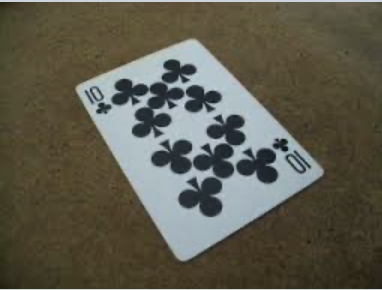
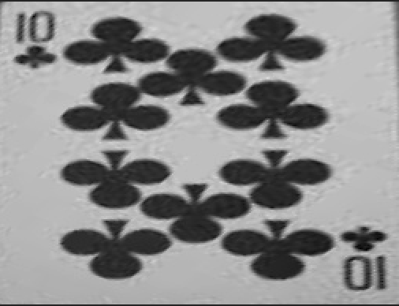

# Automated Perspective Correction for Scanned Documents and Cards

Status: Done

### **Overview**

Modern scanning applications, such as **CamScanner** or built-in iPad scanning tools, employ **perspective correction** to automatically detect and straighten skewed documents. This process ensures that scanned images appear **parallel to the camera viewpoint** and aligned properly, eliminating distortions caused by camera angles.

Many existing solutions require **manual input**—users must provide four corner points of the document to perform perspective transformation. However, a robust **automated pipeline** can detect these corners and apply corrections without user intervention.

This project implements **fully automated perspective correction** using **computer vision techniques**. Given an image of a tilted card or document, the system:

- [ ]  **Identifies edges and contours**
- [ ]  **Extracts the quadrilateral shape**
- [ ]  **Applies perspective transformation** to rectify the angle
- [ ]  **Enhances the image via sharpening**

---

## **Pipeline Overview**

The high-level workflow consists of the following steps:

1. **Read Image** – Load the image and preprocess it.
2. **Edge Detection** – Use **Canny edge detection** to extract edges.
3. **Find Contours & Convex Hull** – Identify closed shapes.
4. **Detect Intersections** – Compute the intersection points forming the quadrilateral.
5. **Validate Quadrilateral Shape** – Ensure detected points form a valid four-cornered structure.
6. **Compute Centroid & Sort Corners** – Order the corners correctly for transformation.
7. **Apply Perspective Transformation** – Use **homography** to correct the skew.
8. **Warp Image** – Perform the transformation to align the document.
9. **Sharpen & Enhance** – Post-process the output for improved clarity.

---

## **Implementation Details**

### **1. Edge and Contour Detection**

The input image, typically a **RGB image (Red-Green-Blue)**, is first **converted to grayscale (0-255 intensity range)**. This simplifies further processing by allowing edge detection algorithms to operate efficiently.

We employ **Canny Edge Detection**, a widely used algorithm that applies **Gaussian filtering, gradient computation, non-maximum suppression, and hysteresis thresholding** to extract prominent edges in the image.

```jsx
edges = cv2.Canny(image, threshold1=100, threshold2=150)
```

Once edges are detected, we extract **contours and the convex hull** to identify shapes within the image.

---

### **2. Quadrilateral Detection**

The system analyzes the detected contours to determine if they form a **quadrilateral**. This is achieved through:

- **Finding intersection points** of contour edges
- **Filtering valid four-cornered shapes**
- **Sorting the corners (Top-Left, Top-Right, Bottom-Left, Bottom-Right)**

If a quadrilateral is successfully detected, its centroid is computed to help distinguish **top and bottom edges**.

```python
centroid_x = sum_x / len(points)
centroid_y = sum_y / len(points
```

Using centroid-based sorting, the corners are arranged in the correct order for transformation.

---

### **3. Perspective Transformation & Homography Correction**

Once the **four corner points** are identified, we apply a **homography transformation** to warp the image into a corrected perspective.

A homography is a **3×3 transformation matrix HH** that maps points from the distorted plane to the corrected plane. It is computed using **OpenCV’s `cv2.getPerspectiveTransform()` function**:

```python
H = cv2.getPerspectiveTransform(source_corners, destination_corners)
warped_image = cv2.warpPerspective(image, H, (width, height)
```

Here:

- **`source_corners`** = Detected quadrilateral corners
- **`destination_corners`** = Mapped rectangle (aligned to the image frame)
- **`H`** = Homography matrix used for transformation

This step ensures that the output image is properly aligned, eliminating skewed perspectives.

---

### **4. Image Enhancement & Sharpening**

After the perspective correction, the transformed image may lose sharpness due to **resampling artifacts**. To enhance clarity, we apply **Gaussian blur and contrast adjustment**.

```python
blurred = cv2.GaussianBlur(warped_image, (5, 5), sigmaX=2)
sharpened = cv2.addWeighted(warped_image, 1.5, blurred, -0.5, 0)
```

This **sharpens edges** while maintaining smoothness, making the final output **clearer and more readable**.

---

## **Technical Architecture**

### **1. `Coordinates` Class (Manages Intersection Points & Centroid)**

Handles:

- **Storage of detected intersections**
- **Centroid computation** for sorting corner points
- **Quadrilateral validation**

### **2. `Perspective` Class (Handles Perspective Transformation & Warping)**

Handles:

- **Edge detection** (`handle()`)
- **Contour & convex hull analysis** (`contourmethod()`)
- **Perspective transformation & warping** (`transform()`)
- **Sharpening & enhancement** (`showsharpen()`)

---

## **Code Repository & Resources**

Input:



Output:




---

## **Conclusion**

This project provides a **fully automated perspective correction pipeline** for scanned documents and cards. By leveraging **edge detection, contour analysis, and homography transformation**, the system eliminates distortions and ensures a **perfectly aligned scan without user input**.

This method can be extended to various applications, including:

- [ ]  **OCR (Optical Character Recognition)**
- [ ]  **Augmented Reality (AR) Registration**
- [ ]  **Robotic Vision & Object Alignment**

Future work includes **deep learning-based quadrilateral detection** for enhanced accuracy and robustness.
